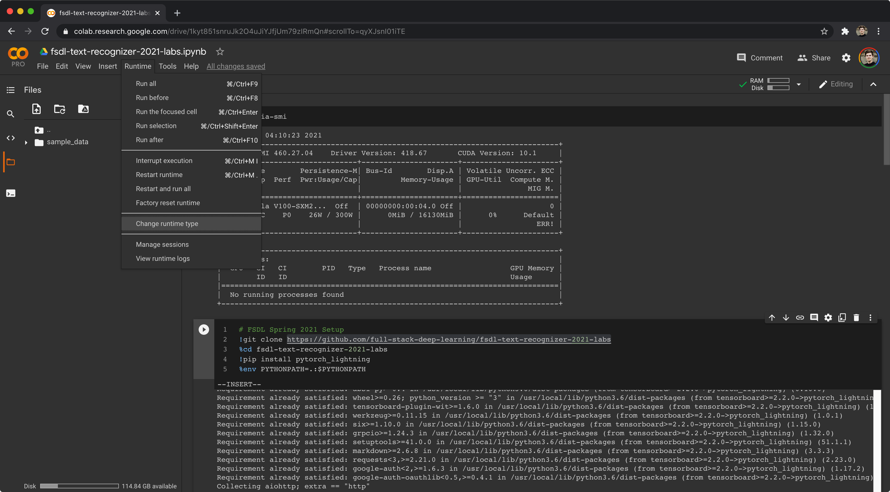
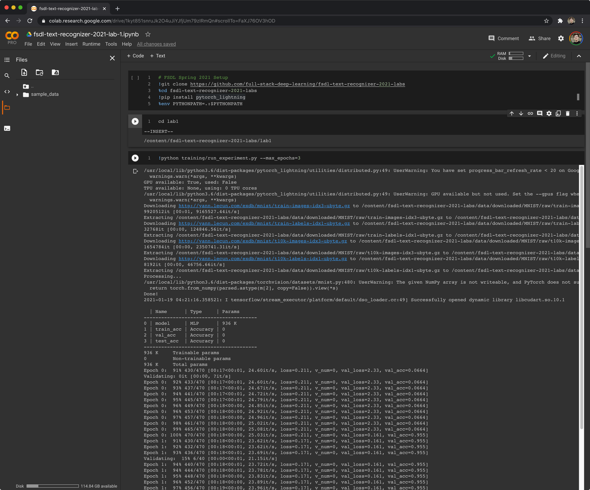
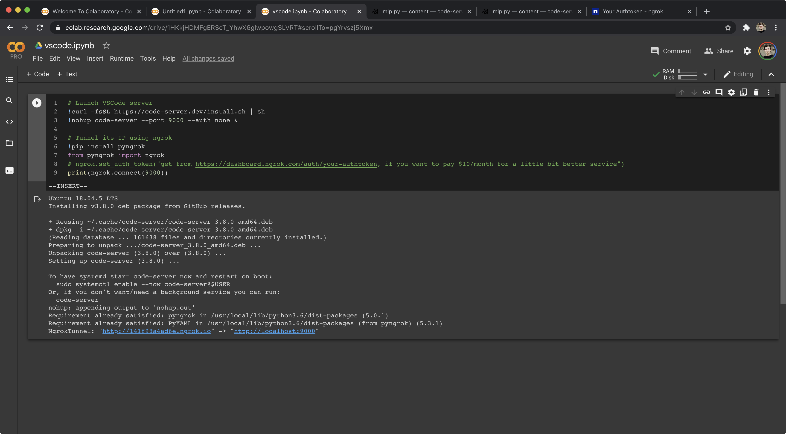
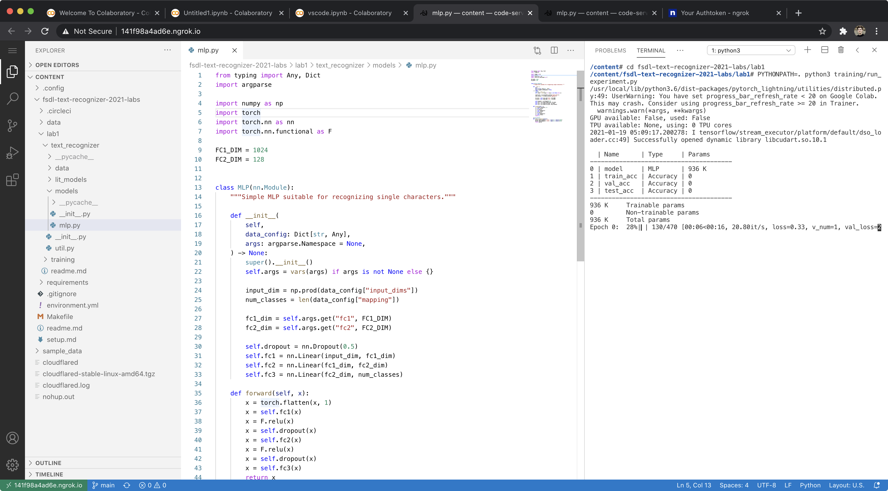

# Setup

Deep learning requires access to accelerated computation hardware, specifically NVIDIA GPUs or Google TPUs.

If you have access to a computer with an NVIDIA GPU running Linux, you can set it up for local use.  
If not, you can compute using **Google Colab**.

If you'd like to use Google Cloud Platform, fullstack deep learning from [Berkely](fullstackdeeplearning.com) have a tutorial for setting up an AI Platform Jupyter Lab instance for computing, which works quite well. A well illustrated [tutorial](https://docs.google.com/document/d/1mSB_p1Chxg6IGYbuRxgPSA3Ps6BjhBZV7Ti3W_Qx0Ws/) for setting up an AI Platform Jupyter Lab instance for computing, which works quite well.


---

## Colab

**[Watch As Video](https://www.loom.com/share/9c99c49fb9ca456bb0e56ccc098ae87a)**

Google Colab is a great way to get access to fast GPUs for free. All you need is a Google account (Berkeley accounts will work too, or a business account with a gcp platform).

1. Go to [Google Colab](https://colab.research.google.com) and create a **New Notebook**.

2. Connect your notebook to a GPU runtime:  
   **Runtime > Change Runtime type > GPU**.

   !Connect your new notebook to a GPU runtime by doing Runtime > Change Runtime type > GPU.


3. Run the following in the first cell to check your GPU:

   ```python
   !nvidia-smi
   ```

   You should see a table showing your GPU. :)

4. Paste the following into a cell and run it:
this is the full stack deeplearning lab 1 materials and its associate repository

   ```python
   # FSDL Spring 2021 Setup
   !git clone https://github.com/full-stack-deep-learning/fsdl-text-recognizer-2021-labs
   %cd fsdl-text-recognizer-2021-labs
   !pip3 install boltons wandb pytorch_lightning==1.1.4
   !pip install torch==1.7.1+cu110 torchvision==0.8.2+cu110 torchaudio==0.7.2 torchtext==0.8.1 -f https://download.pytorch.org/whl/torch_stable.html
   %env PYTHONPATH=.:$PYTHONPATH
   ```

  This will check out the lab repository, `cd` into it, install the only missing Python package (`pytorch_lightning` -- everything else, like PyTorch itself, comes pre-installed on Colab), and allows Python to find packages in the current working directory.

Now we can enter the `lab1` directory and make sure things work:

---

## Colab Pro

You may be interested in signing up for [Colab Pro](https://colab.research.google.com/signup).

For $10/month, you get:
- Priority access to fast GPUs (e.g. V100 vs K80) and TPUs
- 24h rather than 12h runtime
- More RAM

---

## VSCode on Google Colab (Advanced)

It is possible to use the VSCode interface in Colab.

1. Open a Colab notebook, connect to your desired runtime, and run:

   ```python
   # Launch VSCode server
   !curl -fsSL https://code-server.dev/install.sh | sh
   !nohup code-server --port 9000 --auth none &
   
   # Tunnel its IP using ngrok
   !pip install pyngrok
   from pyngrok import ngrok
   # ngrok.set_auth_token("get from https://dashboard.ngrok.com/auth/your-authtoken, if you want to pay $10/month for a little bit better service")
   url = ngrok.connect(9000)
   print(url)
   ```

   You should see something like this:

   

2. Clicking the ngrok link takes you to a web VSCode interface:

   ![VSCode in browser via ngrok]:
   

You can sign up for a paid version of ngrok ($10/month) for HTTPS tunneling and a slightly nicer experience.

---

## Local Setup

Setting up a machine you can sit in front of or SSH into is easy.

### 1. Check out the repo

```bash
git clone https://github.com/full-stack-deep-learning/fsdl-text-recognizer-2021-labs.git
cd fsdl-text-recognizer-2021-labs
```

### 2. Set up the Python environment

We use **conda** for managing Python and CUDA versions, and **pip-tools** for managing Python package dependencies.

First, install the Python + CUDA environment using Conda:

- [Install conda](https://conda.io/projects/conda/en/latest/user-guide/install/linux.html)

After installing, restart your terminal and ensure you can run the `conda` command.

Run:

```bash
make conda-update
```

This creates an environment called `fsdl-text-recognizer-2021` as defined in `environment.yml`.

Next, activate the conda environment:

```bash
conda activate fsdl-text-recognizer-2021
```

> **IMPORTANT:** Every time you work in this directory, start your session with `conda activate fsdl-text-recognizer-2021`.

---

### 3. Install Python packages

Install all necessary Python packages:

```bash
make pip-tools
```

Using pip-tools lets us:
- Separate dev from production dependencies (`requirements-dev.in` vs `requirements.in`)
- Have a lockfile of exact versions for all dependencies (`requirements-dev.txt` and `requirements.txt`)
- Easily deploy to targets that may not support the conda environment

If you add, remove, or need to update versions of some requirements, edit the `.in` files and run `make pip-tools` again.

---

### 4. Set PYTHONPATH

Run:

```bash
export PYTHONPATH=.:$PYTHONPATH
```

To avoid setting this every time, add it as the last line of your `~/.bashrc` file:

```bash
echo 'export PYTHONPATH=.:$PYTHONPATH' >> ~/.bashrc
source ~/.bashrc
```

---

## Summary

- `environment.yml` specifies python and optionally cuda/cudnn
- `make conda-update` creates/updates the conda env
- `conda activate fsdl-text-recognizer-2021` activates the conda env
- `requirements/prod.in` and `requirements/dev.in` specify python package requirements
- `make pip-tools` resolves and installs all Python packages
- Add `export PYTHONPATH=.:$PYTHONPATH` to your `~/.bashrc` and source it

---